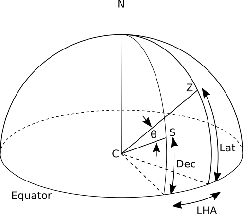
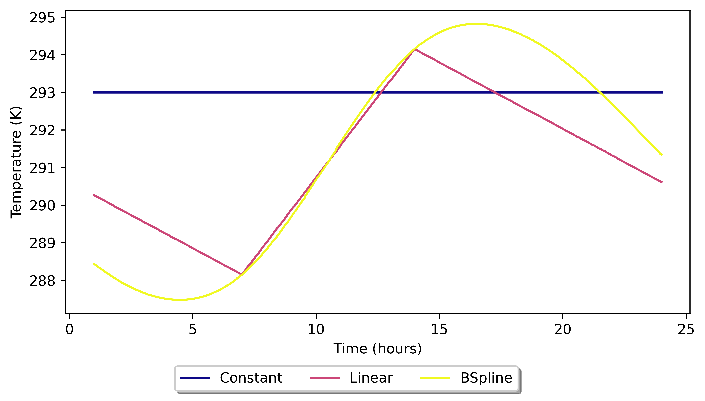
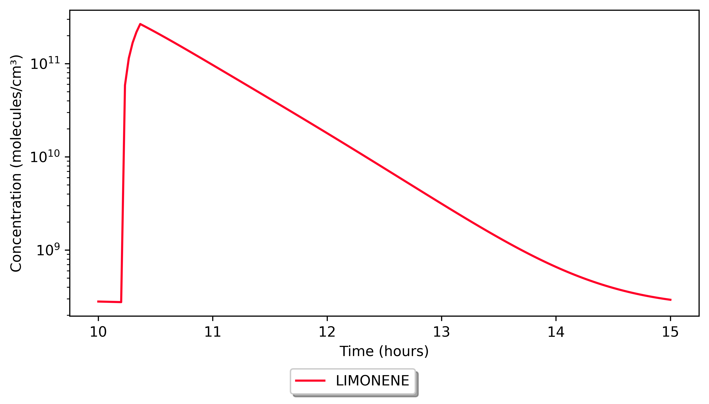

Implementations
===============

Time
----

INCHEM-Py works in local solar time, i.e. it uses a 24 hour period dictated by the location of the Sun in the sky, which is dependent only on the date and the latitude of the location.

The date input is used to calculate the declination angle of the Sun as

.. math::

   \index{declination angle}
       DEC = -23.45 \times \cos\left(\frac{360}{365.25}\times (d+10)\right)

where :math:`d` is the number of days since the start of the year. This accounts for the orbit of the Earth and we can use the solar zenith angle (the angle between the zenith of the location and the solar rays) to account for the rotation of the Earth.

In figure `2 <#fig:solarzenith>`__ the solar zenith angle is shown as :math:`\theta`. C denotes the centre of the Earth with the line C to S representing the trace of the solar rays and the line C to Z representing the zenith of the location being modelled. Lat is the latitude of the location and Dec is the declination angle of the Sun. LHA is the local hour angle and is the angle between the meridian of the Sun and the meridian of the location being modelled, it is calculated in radians as

.. math:: LHA = \left(1+\left(\frac{t}{4.32e4}\right)\right)\times\pi

where :math:`t` is the time of day in seconds. With this information, the solar zenith angle can be calculated using some simple trigonometry and the spherical law of cosines as

.. math::

   \begin{gathered}
       \cos(\theta) = \cos(90-Lat)\cos(90-Dec)\\
       +\sin(90-Lat)\sin(90-dec)\cos(LHA)
   \end{gathered}

which simplifies to

.. math:: \cos(\theta) = \sin(Lat)\sin(Dec)+\cos(Lat)\cos(Dec)\cos(LHA)

No input for longitude is required for these calculations as local solar time will be the same for all latitudes. Therefore, the model must make sure that local outdoor concentrations are also corrected to solar noon if used. Website tools such as `solcalc <https://www.esrl.noaa.gov/gmd/grad/solcalc/>`__ can be used to calculate when solar noon is in local time, from which an adjustment can be made.

Example 1: My office in York is located at latitude 53.94 :math:`^{\circ}` and longitude -1.05 :math:`^{\circ}`. On the 12\ :math:`^{th}` of November 2020, solar noon was 11:48:24 in local time. Therefore any measurements I made on that day using local time will need to be shifted forward by 11 minutes and 36 seconds for consistency with the calculation of photolysis rates in the model.

Example 2: If you were based in St Lucia at 14.00 degrees latitude and -60.93 degrees longitude on the 5\ :math:`^{th}` of May 2018, when solar noon was at 12:00:25 local time, outdoor measurements would need to be shifted 25 seconds back for consistency with the photolysis rate calculations.

The output concentrations from the model are also in local solar time and will need to be converted to local time if to be compared to any measurements taken in local time. For the two examples above, the opposite shift would need to be made.

Example 3: I run a simulation to compare with experimental data gathered in Nuuk (Greenland) on the 9\ :math:`^{th}` of March 2021. Nuuk is at 64.18 degrees latitude and -51.72 degrees longitude with solar noon at 12:44:42 local time. As such I would need to shift the simulated output concentrations forwards by 44 minutes and 42 seconds to put them into local time.

Some outdoor fit calculations (OH, HO\ :math:`_2`, CH\ :math:`_3`\ O\ :math:`_2`, HONO) use the cosine of the solar zenith angle (labelled as ’cosx’ in the outdoor photolysis rate calculations in the model, :math:`\cos(\theta)` in equations (3) and (4) above) and thus are already in local solar time.

The model uses a horizon at 90\ :math:`^{\circ}` to the zenith (the astronomical horizon). Any simulation where the declination of the Sun plus the latitude is over 90\ :math:`^{\circ}` or below -90\ :math:`^{\circ}` will have the Sun below the horizon. This does not mean the location cannot be simulated, simply that the location will have no sunlight. At its maximum, the solar declination angle is :math:`\pm`\ 23.45\ :math:`^{\circ}` meaning that locations beyond :math:`\pm`\ 66.55\ :math:`^{\circ}` (within the Arctic or Antarctic circle) will have no sunlight at this time, depending on time of year.

Temperature
-----------

Two variables are used to define the temperature in INCHEM-Py. The first one ("spline") sets the method by which the temperature is calculated, either as a fixed value, as a linear interpolation or as a B-Spline interpolation. If the fixed value is used then the second variable ("temperatures") is ignored.

Setting "spline" as a number (in Kelvin) sets the temperature to that number for the entire simulation.

The "temperatures" variable is a list of times in seconds and temperatures in Kelvin at that time. Its form is shown in the settings.py section of this manual. This gives points of temperature in time that can be joined by one of two methods: a linear interpolation or a B-Spline interpolation. An example is given in Figure `3 <#fig:temperature>`__, where the "temperature" variable is set as follows:

::

   temperatures = [[25200,288.15],[50400,294.15]]

In both interpolated cases the temperatures given do not cover the entire simulated period. INCHEM-Py therefore assumes a repeating diurnal pattern to the temperature and repeats the last given temperature and time onto the previous day, and the first given temperature and time onto the next day. In this way INCHEM-Py always has a temperature available to use in calculations.

The linear interpolation is calculated using the Numpy library’s interp function and the B-Spline is calculated using the Scipy interpolate library’s BSpline function. The knots, spline coefficient and degree of the B-Spline are calculated using the Scipy interpolate library’s splrep function with a smoothness variable of 0, which forces the interpolated function through the given points. This can be changed in the inchem_main.py file. In all cases it should be noted that the B-Spline function has a tendency to "overfit" the given parameters and will not necessarily give the same fit over a multi-day simulation.

Integration
-----------

INCHEM-Py uses `scipy.integrate.ode <#https://docs.scipy.org/doc/scipy/reference/generated/scipy.integrate.ode.html>`__ which is a class that gives access to various numerical integrators. Due to the stiff and highly coupled nature of the system, LSODA from the Fortran solver package `ODEPACK <#http://www.netlib.org/odepack/>`__ is used (Hindmarsh 1983).

The default integrator arguments set within INCHEM-Py are as follows:

-  | ``atol = [1e-6]*num_species``
   | The absolute tolerance for solution. "num_species" is the total number of species.

-  | ``rtol = 1e-6``
   | The relative tolerance for solution.

-  | ``first_step = 1e-10``
   | The size of the first integration step to try (s).

-  | ``nsteps = 5000``
   | The maximum number of internal time steps allowed.

The integrator will report a return code to the console when it has stopped running. This could be to say that the integration was successful or it might report an error if the integration has failed. The return codes are as follows:

| 2 - Integration successful.
| -1 - Excess work done on this call (perhaps wrong Dfun type).
| -2 - Excess accuracy requested (tolerances too small).
| -3 - Illegal input detected (internal error).
| -4 - Repeated error test failures (internal error).
| -5 - Repeated convergence failures (perhaps bad Jacobian or tolerances).
| -6 - Error weight became zero during problem.
| -7 - Internal workspace insufficient to finish (internal error).

The return codes can point to any number of issues with the model which are too numerous to go through in this manual. If changes have only been made to the settings.py file then the most likely failure would be due to timed emissions causing fast changes in species concentrations. The integrator may then not being able to reach the next time step within "nsteps" due to the small internal time steps required to resolve these fast reactions. The solution to this is to either consider whether the input emission rates are too high or to decrease "dt" in settings.py to give the integrator a shorter interval to integrate over. It is also an option to "ramp up" the timed emissions to smooth the simulation into the emission. I.e. have the timed emission on for a second at 10% of the total emission rate, then a second at 50% and then at 100%.

During integration the model will attempt to use multiple threads. To stop this using all available resources of the computer, threadpoolctl is used. ``threadpool_limits(limit=4)`` keeps the simulation using a maximum of 4 threads. This is set at the start of the integration within "inchem_main.py" and can be increased for faster machines.

.. _outdoor_concentrations.py:

Outdoor concentrations
----------------------

Outdoor concentrations are set in one of two ways. Most simply, the user can set a constant outdoor value for a species. The user can refer to the outdoor_concentrations.py module to see which concentrations are already set and to which values. To add a new outdoor species, simply take the name of the species you wish to have an outdoor concentration of, add "OUT" to the end of it, and add an entry into the dictionary with a concentration in molecules cm\ :math:`^{-3}`. If a species does not appear in the outdoor dictionary, the outdoor concentration is 0.

It is also possible to define a diurnal profile for outdoor concentrations. For OH, HO\ :math:`_2`, CH\ :math:`_3`\ O\ :math:`_2`, and HONO, concentrations are calculated with dependency on the solar zenith angle. Diurnal outdoor concentrations for O\ :math:`_3`, NO\ :math:`_2`, NO, and PM\ :math:`_{2.5}` (TSPOUT) have been been obtained from fits to measurements from four European locations. We have included three profiles from data measured in 2018 for different types of location. This data was downloaded from the `European air quality database <https://aqportal.discomap.eea.europa.eu/products/data-viewers/statistical-viewer-expert/>`__ for the following background stations:

-  GB0566A, urban London, -0.125889 51.52229

-  GB0586A, suburban London, 0.070766 51.45258

-  NO0120A, urban Bergen, 5.312674 60.395929

The downloaded data for these three locations are provided as hourly averages, with a start time and an end time. A midpoint time was set and then shifted from local time, given in UTC, to solar time using the station longitude. The solar shift varies with time and should be calculated for each time point given by the stations. Quarter three data (July, August, September) was then extracted from the year and daily measurements overlaid. Hourly averages of both the time and the concentration were used to fit the trigonometric Fourier functions which are included in INCHEM-Py.

A fourth city, Milan, is also included, based on Terry et al. (2014) (Terry et al. 2014). This data is from a particularly polluted two week period in Milan in August 2003. The raw data for the 2 week period was averaged to a 24 hour period and a trigonometric Fourier function fit compiled.

Additional fits to locations can be added to the outdoor_concentrations.py file in the diurnal function following the format given within the file. These functions use n for the time value as a repeating time series between 0 and 86400 s. The process of extracting, averaging, and fitting raw outdoor measured data is not trivial and requires decisions about handling raw data which is not for us to prescribe. We can provide advice and assistance if required.

Calculating diurnal concentrations outdoors is optional. If the user defines constant outdoor averages and also diurnally varying outdoor concentrations, the latter will take precedence as they are calculated second by the model. Outdoor concentrations are set as inputs, the model does not update outdoor values based on transfer from indoors.

To help choose which outdoor concentration might be best for your purposes, plots of outdoor concentrations fits from the different locations are shown in appendix `9 <#outdoor_fits>`__.

.. _photolysis.py:

Photolysis
----------

Photolysis in INCHEM-Py is calculated for both indoor light sources and sunlight entering from outdoors. These values are then summed and used as a total photolysis rate for photolysis reactions. The following photolysis coefficients are calculated with the corresponding species or species group:

.. container:: flalign*

   | J1&: O_3 O(^1D) + O_2
   | J2&: O_3O(^3P)+O_2
   | J3&: H_2O_2 OH + OH
   | J4&: NO_2 NO + O(^3P)
   | J5&: NO_3 NO + O_2
   | J6&: NO_3 NO_2 + O(^3P)
   | J7&: HONO NO+OH
   | J8&: HNO_3 NO_2 + OH
   | J11&: HCHO H+HCO
   | J12&: HCHO H_2+CO
   | J13&: CH_3CHO CH_3 + HCO
   | J14&: C_2H_5CHO C_2H_5 + HCO
   | J15&: C_3H_7CHOC_3H_7 + HCO
   | J16&: C_3H_7CHOC_2H_4 + CH_3CHO
   | J17&: IPRCHO C_4H_9 + HCO
   | J18&: MACR CH_2=CCH_3+HCO
   | J19&: MACRCH_2=C(CH_3)CO+H
   | J20&: C_5H_8O_3CH_3C(CHO)=CHCH_2O+OH
   | J21&: CH_3C(O)CH_3CH_3CO + CH_3
   | J22&: MEKCH_3CO+C_2H_5
   | J23&: MVKCH_3CH=CH_2 + CO
   | J24&: MVKCH_3CO + CH_2=CH
   | J31&: GLYOXCO + CO + H_2
   | J32&: GLYOXHCHO + CO
   | J33&: GLYOXHCO + HCO
   | J34&: MGLYOXCH_3CO + HCO
   | J35&: BIACETCH_3CO + CH_3CO
   | J41&: CH_3OOHCH_3O + OH
   | J51&: CH_3ONO_2CH_3O + NO_2
   | J52&: C_2H_5ONO_2C_2H_5O + NO_2
   | J53&: n-C_3H_7ONO_2n-C_3H_7O + NO_2
   | J54&: i-C_3H_7ONO_2CH_3C(O)CH_3 + NO_2
   | J55&: t-C_4H_9NO_3t-C_4H_9O + NO_2
   | J56&: NOACH_3C(O)CH_2(O)+NO_2
   | J57&: NOACH_3CO+HCHO+NO_2
   | J70&: Cl_2Cl+Cl
   | J71&: ClNO_2NO_2+Cl
   | J72&: ClONO_2NO_3+Cl
   | J73&: ClONO_2NO_2+Cl
   | J74&: HOClOH+Cl
   | J75&: OClOO+ClO
   | J76&: ClOO+Cl
   | J77&: ClOOClClOO+Cl
   | J78&: ClOOClClO+ClO

The absorption cross-section of a species, or group of species, is wavelength dependant. For INCHEM-Py, the wavelengths of multiple light sources, and the transmission factor of wavelengths through multiple glass types have been used to calculate the photolysis coefficients 1 m away from these sources of light. Full details of this process can be found in Wang et al. (Wang et al. 2022).

The light types (and their corresponding input parameter for "light_type") are shown below. Details of these lights for calculating the photolysis rates were taken from Kowal et al. (2017) (Kowal, Allen, and Kahan 2017).

-  Incandescent ("Incand")

-  Halogen ("Halogen")

-  Light emitting diode ("LED")

-  Compact fluorescent lamps ("CFL")

-  Uncovered fluorescent tube ("UFT")

-  Covered fluorescent tube ("CFT")

-  Fluorescent tube ("FT")

The glass types, wavelength range (and "glass" input parameters) are shown below. The transmittance of these different glass types were taken from Blocquet et al. (2018) (Blocquet et al. 2018).

-  Glass C Sacht self-cleaning, 315-700 nm ("glass_C")

-  Low emissivity, 330-700 nm ("low_emissivity")

-  Low emissivity with film, 380-700 nm ("low_emissivity_film")

Options to have the lights off and no sunlight are also given, the outdoor concentrations are set and are unaffected by these parameters.

.. _surface_dictionary.py:

Surface deposition
------------------

INCHEM-Py can treat surface deposition of H\ :math:`_2`\ O\ :math:`_2` and O\ :math:`_3` separately to other species, where their deposition depends on different surfaces and can result in surface emissions. This is done by setting "H2O2_dep" or "O3_dep" to True. With either variable set to True the surface area to volume ratio (in cm\ :math:`^{-1}`) will be a sum of the surface area to volume ratios of the different surfaces given in the "surface_area" dictionary. If "H2O2_dep" and "O3_dep" are set to False then a sum of the surface_area dictionary divided by the volume variable is used.

The surface to volume (A/V) ratio of a given space is calculated from the volume variable and surface_area dictionary. Within the surface dictionary, the deposition velocities are multiplied by A/V and then fed to the ODE for each species. Particles are assigned a deposition velocity of 0.004 cm s\ :math:`^{-1}`, as described in Carslaw et al. (2012) (Nicola Carslaw et al. 2012). Species that do not have a value within the surface dictionary are given a deposition velocity of 0, and do not deposit. Deposition of any new species can be added in the custom_input.txt file as a reaction with the rate coefficient of the deposition velocity, as follows:

::

   0.016*AV : species1 =

When "H2O2_dep" or "O3_dep" is set to True, INCHEM-Py uses surface-specific deposition velocities (cm s\ :math:`^{-1}`), surface-specific surface to volume ratios (given in "surfaces_AV"), and gas concentrations of H\ :math:`_2`\ O\ :math:`_2` and O\ :math:`_3` to calculate surface losses for one/both species. A known yield is then used to calculate the emission of various species from each surface. Details on the calculation of yields, deposition velocities and emissions from surfaces due to H\ :math:`_2`\ O\ :math:`_2` and O\ :math:`_3` deposition is given in Carter et al. (2023) (Carter et al. 2023).

.. _breath_emissions:

Breath emissions
----------------

INCHEM-Py can include the breath emissions from adults and children, as discussed in Carter et al. (2023) (Carter et al. 2023). The number of adults and children can be set in settings.py. The function for breath emissions is in the surface_dictionary.py file where changes to emission rates can be made. The measured emission rate values are shown in Table `1 <#tab:breath_emissions>`__. These are input into the model and adjusted to the appropriate volume of the room by multiplying these values by 171 m\ :math:`^2` (the volume of the classroom in which these measurements were taken) and dividing by the volume variable.

.. container::
   :name: tab:breath_emissions

   .. table:: Breath emissions included in INCHEM-Py, all rates in molecules cm\ :math:`^{-3}` s\ :math:`^{-1}` (Carter et al. 2023)

      +-------------+---------------------------------------+---------------------------------------+
      | Species     | Adult rate                            | Child rate                            |
      +=============+=======================================+=======================================+
      | Acetone     | 2.534\ :math:`\times`\ 10\ :math:`^7` | 4.781\ :math:`\times`\ 10\ :math:`^6` |
      +-------------+---------------------------------------+---------------------------------------+
      | Ethanol     | 1.98\ :math:`\times`\ 10\ :math:`^7`  | 3.009\ :math:`\times`\ 10\ :math:`^6` |
      +-------------+---------------------------------------+---------------------------------------+
      | Methanol    | 8.512\ :math:`\times`\ 10\ :math:`^6` | 3.108\ :math:`\times`\ 10\ :math:`^6` |
      +-------------+---------------------------------------+---------------------------------------+
      | Isopropanol | 3.862\ :math:`\times`\ 10\ :math:`^6` | 6.593\ :math:`\times`\ 10\ :math:`^5` |
      +-------------+---------------------------------------+---------------------------------------+
      | Isoprene    | 5.412\ :math:`\times`\ 10\ :math:`^6` | 5.953\ :math:`\times`\ 10\ :math:`^5` |
      +-------------+---------------------------------------+---------------------------------------+

.. _inchem_chemistry:

Additonal INCHEM reactions
--------------------------

To analyse varying scenarios indoors, additional chemistry mechanisms have been developed by Carslaw and coworkers, and can be included within INCHEM-Py if required. Unlike the MCM, these schemes are not fully explicit. Instead, they typically use the rate coefficients from literature for the preliminary oxidation steps, and then map onto existing MCM species after a few degradation steps where relevant, to reduce additional complexity. The following species have been treated in this way:

-  Linalool (N. Carslaw et al. 2017)

-  Octanal, nonanal, decanal (Kruza et al. 2017)

-  Chlorine (Xue et al. 2015; Wong et al. 2017; Wang et al. 2020), photolysis J70-J74 from `iupac <http://iupac.pole-ether.fr>`__

-  Camphene, carene, terpinene (Nicola Carslaw 2007)

-  Lactic acid

-  Citronellol, geraniol, geranial (citral)

-  Dihydromyrcenol

-  2,5-DMBA

-  :math:`\alpha`-terpinene, :math:`\alpha`-phellandrene, terpinolene

This chemistry is included in the inchem_chemistry.py module. While careful modification is possible, we ask that any additional chemistry is added using the custom_inputs.txt file as detailed in section `4.3 <#custom_input.txt>`__. The chemistry is stored in the following format that any modification should follow:

These species are peroxy radicals to be added to the peroxy radical summation. They are not species included in the MCM.

::

   INCHEM_RO2 = ["species1","species2"]

These summations are summations used in reactions or rate coefficients within the INCHEM additional chemistry.

::

   INCHEM_sums = [["sum_name","species1 + species2 + species3"],
                 ["sum_name2","species4 + species5 + species6"]]

These are generic rate coefficients used in the INCHEM additional chemistry.

::

   INCHEM_rates=[
   ["name","rate coefficient calculation"],
   ["name2","rate coefficient calculation"]
   ]

These are the INCHEM additional chemistry reactions and their rate coefficients.

::

   INCHEM_reactions=[
   ["rate coefficient calculation","species1 + species2 = species3"],
   ["rate coefficient calculation","species4 = species5 + species6"]
   ]

All generic rate coefficients, species and summations can be called in any additional reactions or summations added to the custom_inputs.txt file.

Master array and Jacobian
-------------------------

The master array is a dictionary of species and their ordinary differential equations (ODEs) that are processed by the integrator. The ODEs are constructed from the reactions input from the MCM, the INCHEM chemistry input file, any custom reactions added via the custom inputs file, and the gas-to-particle reactions.

To compute the ODEs the reactions must be parsed. Each reaction comprises of a reaction equation and a rate coefficient. For example:

.. math::

   \begin{split}
       y_1 + y_2 &\xrightarrow[]{k_1} y_3 + y_4\\
       y_2 + y_3 &\xrightarrow[]{k_2} y_1
   \end{split}

where :math:`y_n` represents the species concentration. In the first reaction all species change at a rate of :math:`y_1y_2k_1` and in the second reaction all species change at a rate of :math:`y_2y_3k_2`. The change is either positive or negative, depending on which side of the reaction they are on. The code splits the reaction into loss species (1, 2 and 3) and gain species (1, 3, and 4) and assigns a negative reaction to the ODE of species in the list of loss species, and a positive reaction to the ODE of species in the list of gain species. Therefore the following is obtained:

.. math::

   \begin{split}
       &\frac{dy_1}{dt} = y_2y_3k_2 - y_1y_2k_1\\
       &\frac{dy_2}{dt} = - y_1y_2k_1 - y_2y_3k_2\\
       &\frac{dy_3}{dt} = y_1y_2k_1 - y_2y_3k_2\\
       &\frac{dy_4}{dt} = y_1y_2k_1
   \end{split}

This is repeated for all reactions input into the model. On top of the terms from reactions there are extra terms for air change, surface deposition, and any timed emission changes that are defined in the settings file.

This series of ODEs is the master array and is used to construct the Jacobian and reactivity and production functions. The dictionary is also saved to the output folder so that users may analyse the ODEs should they wish.

The Jacobian is built by parsing the master array. Each ODE is differentiated with respect to each species in the simulation and saved as a compiled code object. This contains each dy/dy equation alongside index positions for the Jacobian matrix.

Timed emissions
---------------

Timed emissions are implemented in the settings.py file ("timed_inputs"). When writing the master array, a term is included in every ODE for a timed emission. This is 0 unless specified in the settings.py file. When specified, INCHEM-Py will set the timed term in the master array to the given rate, when the time step of the simulation is between the user entered start and end time.

Typical use of this function is to input an event into the model where there may be an emission of a species, such as through cleaning. An example for a limonene input is shown below with a sample result in Figure `4 <#fig:timed_limonene>`__.

::

   timed_inputs = {"LIMONENE":[[36720,37320,5e8]]}    

Multiple species can be input as:

::

   timed_inputs = {"LIMONENE":[[36720,37320,5e8]],
                   "APINENE":[[36720,37320,5e8]]}

A single species can be input at multiple times as:

::

   timed_inputs = {"LIMONENE":[[36720,37320,5e8],[39000,39400,5e8]]} 

Reactivity and production
-------------------------

The reactivity.py file contains functions to calculate the total reactivity and total production rates of selected species included in the "reactivity_species" list in the reactivity_summation function (default only OH). The total reactivity of a species, :math:`x`, is the inverse of the lifetime of :math:`x`, and is calculated by summing the reactivity of all other species with :math:`x`. The production rate of a species is a summation of all of the reaction rates that create the species. Reactivity is in units of s\ :math:`^{-1}` and production is in units of molecules cm\ :math:`^{-3}` s\ :math:`^{-1}`.

Additional species reactivity and production values can be added by adding the species in question to the reactivity_species list within the reactivity.py module. By default it is set to only include OH.

::

       reactivity_species = ['OH']

Particles and HOMS
------------------

Particles are discussed in Pankow (1994) and Carslaw (2012) (Pankow 1994; Nicola Carslaw et al. 2012). HOMS are highly oxygenated molecules which quickly create secondary organic aerosols (SOA) from terpenes. In INCHEM-Py all terpenes included within the model can be used to create particles using HOMS reactions, the model requires both particles and INCHEM_additional to be true within the settings file for this to happen. If INCHEM_additional is False then INCHEM-Py will significantly under predict particle production. A discussion on the implementation of particles, but not HOMS, is included in Shaw (2023) (D. R. Shaw et al. 2023).
