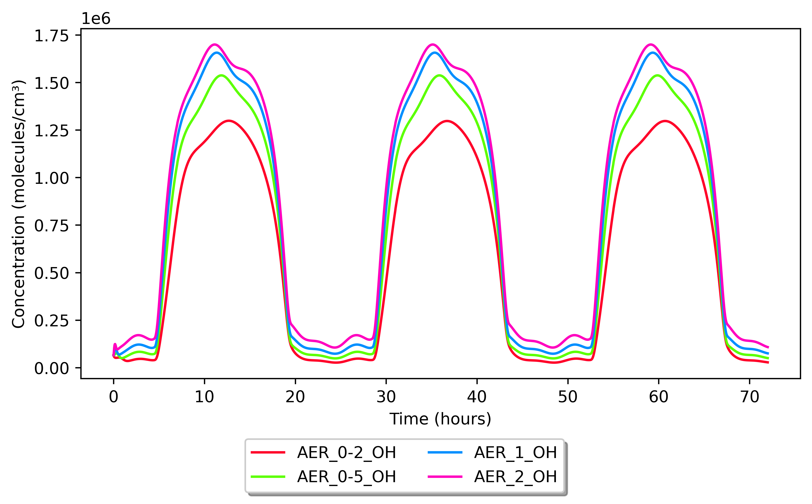

Running INCHEM-Py
=================

A `Quick start <#Quick start>`__ guide is included at the start of this manual.

Once you are happy with the setup of the input files, the model is run via the settings.py file and can be done in a number of ways. Two methods, both using Anaconda, are shown here. If you would like to run the model within an integrated developer environment (IDE, useful for being able to both edit and run the code within the same piece of software) then we recommend Spyder. If you are comfortable running Python from the command line then details of how to do this are also provided.

You may wish to run INCHEM-Py in a virtual environment and guides on how to do this can be found here: https://docs.python.org/3/tutorial/venv.html.

Detailed instructions for using Anaconda can be found here: https://docs.anaconda.com/anaconda/user-guide/getting-started/

Spyder
------

INCHEM-Py was written using the IDE Spyder. Spyder can be installed both with the Anaconda install or from the Anaconda Navigator. Instructions on how to both install and run Spyder can be found here: https://docs.anaconda.com/anaconda/user-guide/getting-started/

Once Spyder is open you can set the INCHEM-Py directory as your working directory using the folder icon in the top right. Then by selecting the files tab at the bottom of that top right window, the settings.py file, or any other file you wish to edit, can be opened to the window on the left by double clicking on it.

Once you are ready the model can be run by opening the settings.py file in the left hand window and either clicking on the green arrow in the toolbar or by pressing F5 on your keyboard. The model will then run in the bottom right console window.

Only one simulation can be run at a time in a single console, but multiple console windows can be opened in the bottom left. Due to the number of resources the simulation requires, multiple simulations may not be any faster than running simulations one after the other.

Anaconda prompt or Terminal
---------------------------

Assuming you have installed Python as recommended via Anaconda, it is possible to run INCHEM-Py from the Anaconda CMD prompt from within the Anaconda Navigator on Windows, or from the terminal in MacOS or Linux. Once the Anaconda prompt or the terminal is open, simply navigate to the INCHEM-Py directory using the change directory command, inputting your file path

::

       cd C:/Directory/AnotherDirectory/INCHEM-Py/

and run the settings.py file with Python

::

       python settings.py

It is also possible to do this with one command:

::

       python C:/Directory/AnotherDirectory/INCHEM-Py/settings.py

However, be aware that this will not work if there are any spaces in the names of any of the directories in the install path.

Batch runs
----------

The settings.py file can be modified to produce batch runs of multiple variable changes. The settings.py file is a script that sets the variables for input and then calls INCHEM-Py. INCHEM-Py will run every time it is imported and provide a new output to a new output folder. By changing variables between multiple imports a batch of runs can be completed.

Using this method does have some limitations, such as not being able to change any variables set in any of the INCHEM-Py modules (not set in the settings file, i.e. the outdoor concentrations) with each run. Modification of INCHEM-Py itself would be required to achieve this.

Checking model function
-----------------------

When first running the model it is possible to check that the default model downloaded is functioning as intended. To do this a copy of the output of a working default model run (default_output.csv) containing the species concentrations with time for O\ :math:`_3` and O\ :math:`_3` outdoors can be found in the test_files folder, as shown in the folder structure. After running the model as downloaded with no changes to default values the output.csv created can be manually compared with the default_output.csv to confirm validity of the run.

Included in the INCHEM-Py module folder is inchem_test.py. This script can be run to test functions of INCHEM-Py that manipulate the input data into useful formats within the model. It uses preset inputs, found within the test_files folder, to check that the model outputs are expected.

When entering new species or chemical mechanisms via the custom_input.txt file, users should be careful that names are correct and reactions are not duplicated. The model does not test for duplicate species or new species as both are valid inputs. Many outputs are produced by INCHEM-Py that can be used to check that the model ODEs are constructed as expected by the user or that custom chemistry has been entered correctly. The master_array can be viewed to validate reactions, and the Jacobian is saved for a similar purpose. Any user entered mechanisms are also saved alongside mechanisms provided by the INCHEM-Py team.

Example usage
-------------

INCHEM-Py will run with no changes to the inputs, as downloaded. An example of use as a test of the model functionality would be to adjust the air change rate ("ACRate") which will change the concentrations of all species indoors. Typical household values would be between 0.2 h\ :math:`^{-1}` and 2 h\ :math:`^{-1}` (Weschler 2000). Output concentrations for OH with variations in ACRate and all other settings unchanged from the INCHEM-Py download default values are shown in Figure `1 <#fig:OH_AER>`__.

