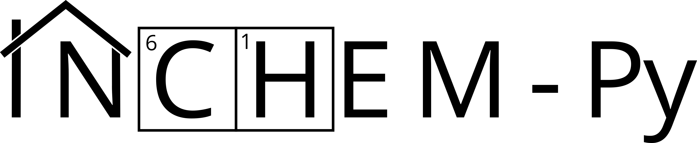

INCHEM-Py documentation
=======================

|

The **INdoor CHEMical model in Python (INCHEM-Py)** is an open source box
model that creates and solves a system of coupled ordinary differential
equations (ODEs) to predict the concentrations of indoor air pollutants
through time. It is a refactor of the indoor detailed chemical model
originally developed by Carslaw (2007), with improvements in form,
function, and accessibility.

INCHEM-Py combines the near-explicit `Master Chemical Mechanism (MCM)
<https://mcm.york.ac.uk/>`_ with additional mechanisms developed
specifically for indoor air. These include gas-to-particle partitioning
for common indoor terpenes, an improved photolysis parameterisation,
indoor–outdoor air exchange, and deposition to surfaces.

This documentation covers **version 1.3**. If you are upgrading from an
earlier release, start with :doc:`whats_new` for a summary of what has
changed and what you may need to adjust in your ``settings.py`` file.

.. note::

   New to Python or to INCHEM-Py? The :doc:`quickstart` guide walks you
   through installing, running, and extracting your first results in a
   few minutes.

.. toctree::
   :maxdepth: 2
   :caption: Getting started

   overview
   whats_new
   quickstart
   dependencies

.. toctree::
   :maxdepth: 2
   :caption: Using the model

   model_setup
   running
   outputs

.. toctree::
   :maxdepth: 2
   :caption: How the model works

   implementations

.. toctree::
   :maxdepth: 2
   :caption: Reference

   outdoor_fits
   extractor
   reactions_analyser
   community

Indices
-------

* :ref:`genindex`
* :ref:`search`
