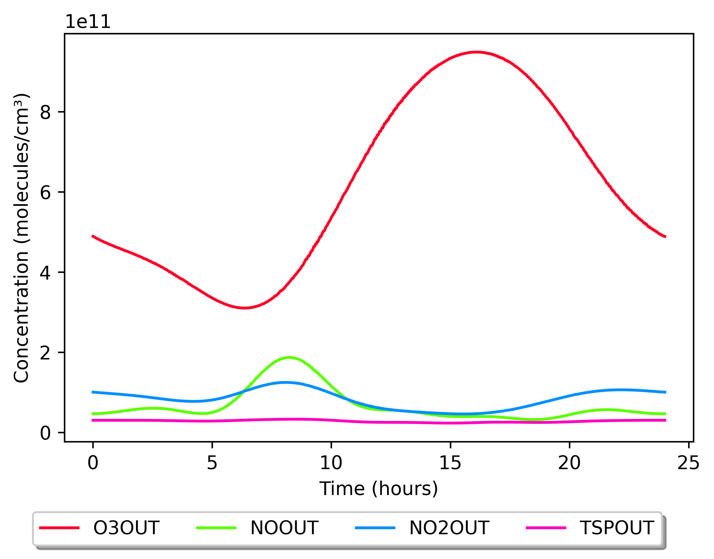
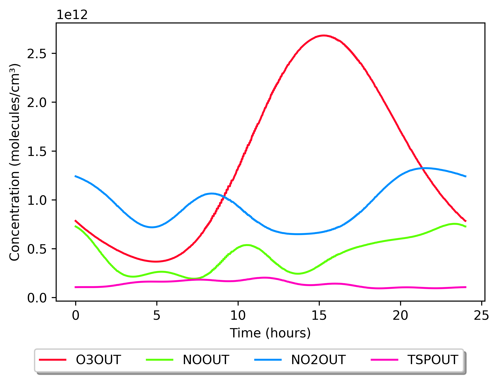

Outdoor concentration fits
==========================

These plots show the outdoor average concentration fits available through the
``city`` setting. They are provided to help choose which fit best suits your
purposes. Because outdoor concentrations strongly affect indoor chemistry,
tailored fits are advised for any specific location; the development team can
provide advice and assistance.

The three 2018 fits are daily averages over July–September (Q3), fitted to
hourly data from the European air quality database for the following
background stations:

* GB0566A, urban London (−0.125889, 51.52229)
* GB0586A, suburban London (0.070766, 51.45258)
* NO0120A, urban Bergen (5.312674, 60.395929)

The Milan fit is from a particularly polluted two-week period in August 2003
(Terry et al., 2014), averaged to a 24-hour period.

Urban London (``London_urban``)
--------------------------------

.. image:: _static/images/London_urban.png
   :alt: Outdoor concentration fits for urban London, Q3 2018
   :width: 100%

Suburban London (``London_suburban``)
-------------------------------------

Urban Bergen (``Bergen_urban``)
-------------------------------

.. image:: _static/images/Bergen_urban.png
   :alt: Outdoor concentration fits for urban Bergen, Q3 2018
   :width: 100%

Milan, August 2003 (``Milan_urban_Aug2003``)
--------------------------------------------

